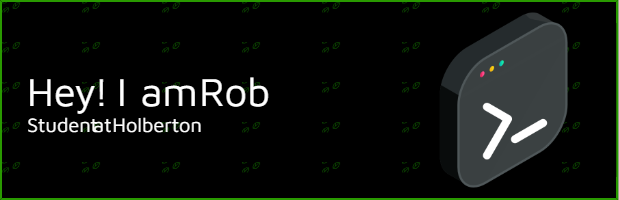

### Hi, I'm [Nomad-Rob](https//utkarssh11.github.io/Nomad-Rob-Portfolio-2.0/)

<em>I'm starting my software engineer journey and trying to figure out what spec to choose from. Either AR/VR or Fullstack!

### A little about me...  

💡 &nbsp; I'm curently a student at Holberton. Doing a career change and loving it! \
🌱 &nbsp;I'm currently working on **improving my coding skills by building small projects.**\
✍️ &nbsp;Apart from technical interests, I like flying, traveling, learning, watching movies, music, ang games.\
💬 &nbsp;Feel free to reach out to me for general consulting, or discussions. \
📫 How to reach me: Through [Linkedin](https://www.linkedin.com/in/robert-farley-a962a1123/) \
👻 Let me know if I can help out on any projects!

<h1 align="center"> Some Projects</h1>
| Project Name      | Description | 
| :---:        |    :----   |  
Working on this part of README

## Languages and Tools I've learned...Will be more in the future!

 
 

 

 

